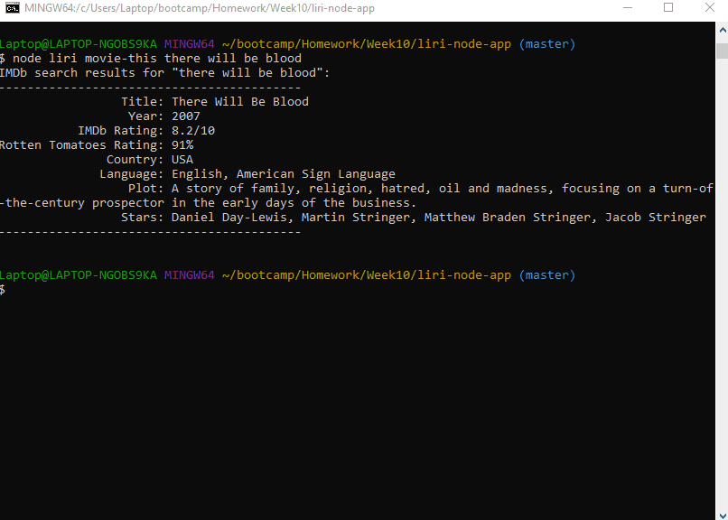

# **"Liri" App**

## Week 10 Homework Assignment, Coding Boot Camp, UNC-Chapel Hill

Originally submitted on 1/10/2019

### Instructions

- node.js script that runs from the command line
- View information on a song, a movie, or see upcoming concerts for a musician
- Use command "help" or leave the command blank to see tips
- "movie-this", "spotify-this-song", "concert-this", or "do-what-it-says" commands to perform different tasks

### About

First project using node.js from the command line, meant to sort of mimic Siri (hense the name Liri). It utilizes a couple of different NPM packages: axios to do OMDB API calls, dotenv for Spotify API environment variables (ID and secret), Spotify API package for API calls, and moment to convert concert time to a more easily readable date.

A couple of extra tests and features exist. The random.txt file can be edited in whatever text editor, and run in the command line with the "do-what-it-says" command. It works essentially the same way as the command line commands: command first, then search content after.

A log (log.txt) also keeps track of both user commands and any errors.

### Example Gifs

Created by Barry Riveroll //
[Github](https://github.com/barryriveroll) //
[Portfolio](https://barryriveroll.github.io/Portfolio/)
